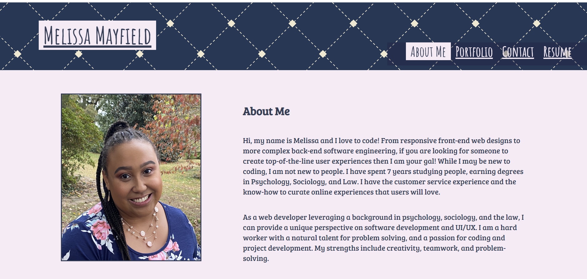

# Mayfield React Portfolio

This repo houses the code used to build the Mayfield React Portfolio available at https://mayfieldmel.github.io/Mayfield-React-Portfolio/.

## My Portfolio

My portfolio offers a brief overview of who I am and what I can do. Explore the many projects I have developed at the UNC Chapel Hill Coding Bootcamp and reach out to get to know me better.

## Tools

* The app was built and developed using Visual Studio Code (VS Code). 
* React & JSX was used to create a single-page website with dynamic content
* HTML structured the webpage
* CSS styled the webpage
* Github hosts the repository.

## Installation

Access deployed link at https://mayfieldmel.github.io/Mayfield-React-Portfolio/ .

## Credits

Made with ❤️ by Melissa Mayfield
